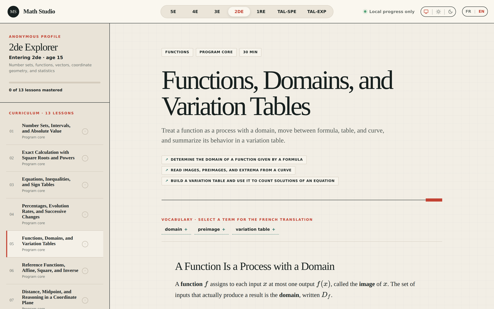

# Math Studio

**[▶ Open Math Studio](https://fredericcogny.github.io/math-studio/)**

Math Studio is a free mathematics learning studio for the French secondary school programme, from `5e` to `Terminale`. Open the link, pick the year you are entering, and start working. There is nothing to install, no account to create, and no name to give.



## What you will find

- **Seven tracks**, one per year of the programme: `5e`, `4e`, `3e`, `2de`, `1re`, `Terminale spécialité`, and `Terminale mathématiques expertes`.
- **68 lessons** in all, each one a short read with clear objectives, key vocabulary, and worked ideas rather than a wall of rules.
- **Four exercises per lesson**, rising from a direct application to an advanced challenge, each with progressive hints and a full model solution.
- **Flashcards** for quick retrieval practice, plus extra generated drills when you want more repetition.
- **Everything in English and French.** One click on `EN` or `FR` switches the whole app, including every lesson, hint, and solution.
- **A Socratic tutor** that asks questions instead of handing over answers, when a key has been configured.

A lesson counts as mastered once you score at least 80% on its core exercises. Stretch and challenge work stays optional, so you can go deeper without being penalized for skipping it.

## Your progress stays with you

Progress is saved in your own browser, under `maths-studio.progress.v1`. It is never uploaded anywhere, and no profile asks for your name. Clearing your browser data resets it, and using a different browser or device starts a fresh slate.

The address bar always reflects what you are looking at, so the **Share** button gives a link that reopens the exact lesson, level, and language you were on.

## For developers

Nix flakes must be enabled on the host.

```bash
nix develop
npm install
npm run dev
```

The flake supplies Node.js 24, Git, GitHub CLI, curl, jq, and ripgrep. `package-lock.json` pins the JavaScript dependency graph after the first install.

Useful commands:

```bash
npm run dev       # local Vite server
npm run test      # deterministic engine tests
npm run build     # type-check and production build
npm run check     # tests and build
npm run test:e2e  # Playwright layout and curriculum tests
```

Pushing to `main` builds the app and publishes it to GitHub Pages through `.github/workflows/deploy.yml`.

The Socratic tutor calls the Google AI Studio API. Copy `.env.example` to `.env.local` and supply a key to enable it; without a key the rest of the app works unchanged.

## Data and content

- Progress is stored in browser `localStorage` under `maths-studio.progress.v1`.
- No learner names are included in profiles or tracked files.
- Clearing site data resets progress; export/import can be added before progress becomes valuable.
- Curriculum direction is documented in `docs/CURRICULUM.md`.
- Lesson authoring is documented in `docs/CONTENT.md`.
